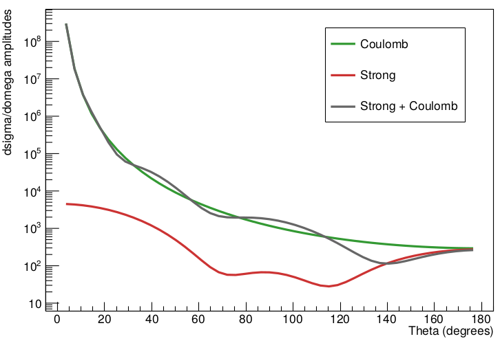

# Elastic Scattering

Antiproton elastic scattering cross section using partial waves

... more explanation here (ask Andrea)...

## Download and compile

```bash
git clone https://github.com/pbarBrescia/elastic-scattering.git
cd elastic-scattering
./compile.sh
```

## Run

Input arguments are:

- Antiproton lab momentum (e.g. 50. MeV/c)
- Target mass in u.a.m. (e.g. 40.078 for Calcium)
- Target charge in e units (e.g. 20. for Calcium)

```bash
./run.sh 50.0 40.078 20.0
```

The printed result is organized in 5 columns: 

1. angle in degrees
2. angle in degrees again from previous code
3. dsigma/domega given by **strong** amplitudes
4. dsigma/domega given by **coulomb** amplitudes
5. dsigma/domega given by **strong+coulomb** amplitudes

Example:

```
[...]
7.2 3.6 4485.88 1.88047e+07 1.82919e+07
10.8 7.2 4352.16 3.72676e+06 3.77601e+06
14.4 10.8 4137.08 1.18462e+06 1.32648e+06
18 14.4 3851.73 488105 506526
[...]
```

## Plot example

Save output data for a given momentum values in a file...

```bash
./run.sh 50.0 40.078 20.0 > out50.dat
```

... and plot it (ROOT example)

```bash
root -l plot.C
```


